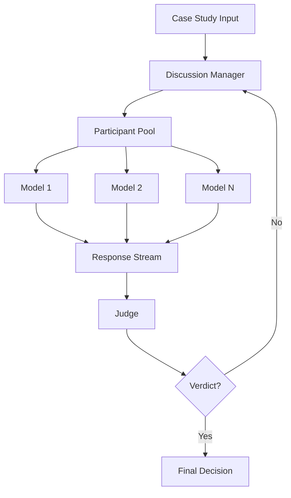

# JuryLLM Architecture

## System Overview

JuryLLM is built on a modular architecture that enables multiple language models to collaborate in a structured discussion format. The system is designed to be extensible, allowing for easy integration of different types of models and discussion formats.



## Core Components

### 1. Model Management (`model.py`)

#### BaseParticipant
- Abstract base class for all participants
- Handles context management
- Defines interface for model interaction

```python
class BaseParticipant:
    def __init__(self, name: str)
    async def process(self, prompt: str) -> AsyncIterator[str]
```

#### OllamaParticipant
- Implementation for local Ollama models
- Handles streaming responses
- Manages model context

```python
class OllamaParticipant(BaseParticipant):
    def __init__(self, name: str, model_id: str)
    async def process(self, prompt: str) -> AsyncIterator[str]
```

#### Judge
- Specialized participant for evaluation
- Monitors discussion quality
- Provides verdicts based on context

### 2. Discussion Management (`jury.py`)

#### Discussion Class
- Core orchestration component
- Manages conversation flow
- Handles async streaming
- Maintains discussion history

```python
class Discussion:
    def __init__(self, participants: List[BaseParticipant], judge: Judge)
    async def discuss(self, case_study: str) -> AsyncIterator[str]
    async def _conduct_round(self, round_num: int) -> AsyncIterator[tuple[bool, str]]
```

### 3. Message System

#### Message Class
- Data structure for communication
- Tracks message metadata
- Maintains conversation context

```python
class Message:
    role: str
    content: str
    name: Optional[str]
```

## Flow Control

1. **Initialization**
   - Load participants and judge
   - Initialize discussion context
   - Set up async environment

2. **Discussion Flow**
   - Format case study
   - Initialize participants
   - Begin discussion rounds

3. **Round Management**
   - Get participant responses
   - Stream responses in real-time
   - Update discussion history

4. **Verdict Process**
   - Judge evaluates discussion
   - Determines if verdict is reached
   - Provides final decision or continues discussion

## Async Implementation

The system uses Python's asyncio for non-blocking operations:

```python
async def discuss(case_study: str):
    # Initialize discussion
    discussion = Discussion(participants, judge)
    
    # Stream responses
    async for response in discussion.discuss(case_study):
        print(response)
```

## Error Handling

1. **Model Errors**
   - Graceful handling of model failures
   - Retry mechanisms for transient errors
   - Clear error reporting

2. **Context Management**
   - Proper cleanup of resources
   - Memory management for large discussions
   - State recovery mechanisms

## Extension Points

1. **New Model Types**
   - Implement BaseParticipant interface
   - Add model-specific processing logic
   - Register with participant pool

2. **Custom Judges**
   - Extend Judge class
   - Implement custom verdict logic
   - Add specialized monitoring

3. **Discussion Formats**
   - Modify Discussion class
   - Implement new round types
   - Add custom evaluation criteria
